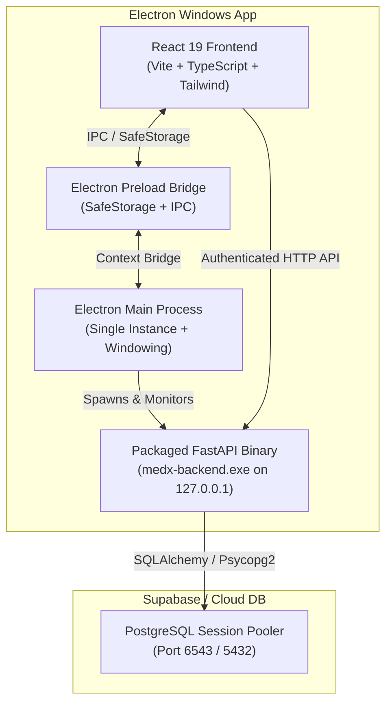

<div align="center">

# 💊 MedX Pharmacy Management System
### *Enterprise Pharmacy Billing, Inventory & Multi-Branch Management ERP*

[](https://github.com/dheeraj-srma/Medx-Pharmacy-Billing-and-Inventory-Management)
[](./LICENSE.md)
[](#)
[](#)
[](#)
[](#)

<p align="center">
  A state-of-the-art, secure pharmacy management solution engineered for high-volume retail, wholesale, and multi-branch pharmacy chains.
</p>

</div>

---

## 🌟 Overview

**MedX Pharmacy** is an end-to-end pharmacy ERP that streamlines prescription sales, real-time inventory management, batch/expiry tracking, supplier procurement, customer records, and multi-branch accounting.

Available as both a **standalone native Windows desktop application** (with embedded local FastAPI runtime) and a **cloud-ready web platform**, MedX provides lightning-fast performance, resilient offline-first capabilities, and robust cloud data synchronization powered by PostgreSQL.

---

## 🚀 Key Modules & Capabilities

```
                  ┌─────────────────────────────────────────┐
                  │          MedX Pharmacy ERP              │
                  └────────────────────┬────────────────────┘
                                       │
        ┌──────────────┬───────────────┼───────────────┬──────────────┐
        ▼              ▼               ▼               ▼              ▼
   ┌─────────┐   ┌───────────┐   ┌───────────┐   ┌───────────┐  ┌───────────┐
   │ Point of│   │ Batch &   │   │ Supplier  │   │ Multi-    │  │ Business  │
   │ Sale    │   │ Expiry    │   │ Ledger &  │   │ Branch    │  │ Analytics │
   │ Billing │   │ Inventory │   │ Purchases │   │ Operations│  │ & Reports │
   └─────────┘   └───────────┘   └───────────┘   └───────────┘  └───────────┘
```

### ⚡ 1. Point of Sale (POS) & Express Billing
- **Barcode Scanner Integration**: Fast item lookup with SKU and batch autofill.
- **Dynamic Payment Splitting**: Support for Cash, UPI/QR, Cards, and Customer Credit.
- **Taxes & Discounts**: Automatic GST calculation (CGST/SGST/IGST) with item-level discount overrides.
- **Invoice Printing**: Thermal receipt (80mm/58mm) and standard A4 invoice formatting with custom pharmacy headers.

### 📦 2. Batch-Wise Inventory & Expiry Control
- **Batch Tracking**: Track MRP, purchase rate, sale rate, supplier batch number, and manufacturing/expiry dates.
- **Automated Expiry Alerts**: Visual color-coded indicators for near-expiry and expired medicines.
- **Low Stock Thresholds**: Automated reorder alerts when items reach safety stock limits.

### 🏢 3. Multi-Branch Operations & RBAC
- **Multi-Branch Support**: Centralized administration with branch-scoped inventory and sales tracking.
- **Role-Based Access Control**: Strict privilege separation between Super Admins and Branch Cashiers.
- **Inter-Branch Stock Transfers**: Transparent movement of stock between branch locations.

### 📑 4. Procurement & Supplier Ledger
- **Purchase Invoices**: Complete purchase order workflow updating stock and cost-averaging.
- **Supplier Credit Ledger**: Real-time tracking of pending dues, payment history, and returns.
- **Debit/Credit Notes**: Streamlined return management for damaged or short-dated goods.

### 📊 5. Financial Reports & Business Intelligence
- **Daily Sales & Revenue Summaries**: Real-time visibility into gross margins, net profit, and sales velocity.
- **GST Compliance Reports**: Tax breakdown summaries ready for accounting filing.
- **Audit Trails**: Non-repudiable audit logs tracking all transactions, stock adjustments, and administrative resets.

---

## 🛠️ Architecture & Tech Stack



| Layer | Technology | Description |
| :--- | :--- | :--- |
| **Frontend** | React 19, TypeScript, Vite, TailwindCSS, Radix UI | Modern, high-performance UI with dark/light themes and reactive caching |
| **Desktop Shell** | Electron 44, Node.js | Hardened desktop container with IPC isolation and local process management |
| **Backend Core** | FastAPI, Python 3.12+, Uvicorn | High-throughput asynchronous REST API |
| **ORM & Database** | SQLAlchemy, Psycopg2, PostgreSQL | Enterprise relational schema with connection pooling and schema migrations |
| **Packaging** | PyInstaller, Electron-Builder (NSIS) | Clean Windows installer bundle with embedded zero-config runtime |

---

## 🔒 Security Architecture

- **Zero Hardcoded Secrets**: Application binaries contain no embedded database passwords, keys, or sensitive credentials.
- **Credential Isolation**: Local user database strings are configured via the setup wizard and saved to `%APPDATA%\MedX Pharmacy\config.env` with restricted file permissions.
- **Loopback Protection**: Inter-process communication between Electron and the local FastAPI server is cryptographically signed with per-session tokens (`X-MedX-Desktop-Secret`).
- **Sanitized Logging**: All runtime logs written to `%APPDATA%\MedX Pharmacy\logs\backend.log` automatically redact passwords, database URIs, and JWT keys.

---

## 💻 Installation & Setup

### Option A: Using the Windows Desktop Installer (.exe)
1. Download the latest installer `MedX Pharmacy Setup 2.1.0.exe` from the [Releases](https://github.com/dheeraj-srma/Medx-Pharmacy-Billing-and-Inventory-Management/releases) section.
2. Run the installer and launch **MedX Pharmacy**.
3. On first startup, the **Setup Wizard** will appear:
   - Enter your cloud **Supabase PostgreSQL Connection URI** (Port `6543`).
   - Click **Test Connection** to verify database reachability.
   - Click **Save & Launch**.
4. Log in using your designated Administrator or Staff credentials.

---

### Option B: Local Development Setup

#### 1. Clone the Repository
```bash
git clone https://github.com/dheeraj-srma/Medx-Pharmacy-Billing-and-Inventory-Management.git
cd Medx-Pharmacy-Billing-and-Inventory-Management
```

#### 2. Backend Setup
```bash
cd backend
python -m venv venv
# On Windows:
.\venv\Scripts\activate

pip install -r requirements.txt

# Create local environment config
cp .env.example .env
# Configure your DATABASE_URL and SECRET_KEY in backend/.env

# Run database migrations
alembic upgrade head

# Start development backend
python server.py --port 8000
```

#### 3. Frontend Setup
```bash
cd ../frontend
npm install
npm run dev
```

#### 4. Run as Desktop Application in Development
```bash
# From the repository root:
npm install
npm run start:desktop:dev
```

---

## 📦 Building the Production Windows Installer

To build the self-contained Windows executable and NSIS installer from source:

```bash
# 1. Compile backend executable with PyInstaller
npm run build:backend

# 2. Build production React bundle
npm run build:frontend

# 3. Package full Windows installer
npm run dist:win:all
```
The output installer will be generated in `dist-electron/MedX Pharmacy Setup 2.1.0.exe`.

---

## 📄 License & Proprietary Rights

This project is governed by a strict **Proprietary Commercial License**. All rights are reserved.

- **No Unauthorized Use**: You may not copy, modify, distribute, publish, sublicense, or commercially exploit this software without prior written authorization from the owner.
- For complete terms and licensing requests, refer to [LICENSE.md](./LICENSE.md).

---

## 🤝 Code of Conduct

All contributors and community participants are expected to adhere to our [Code of Conduct](./CODE_OF_CONDUCT.md).

---

<div align="center">
  <sub>Developed & Maintained by <b>Dheeraj Sharma</b> • MedX Pharmacy Management System</sub>
</div>
